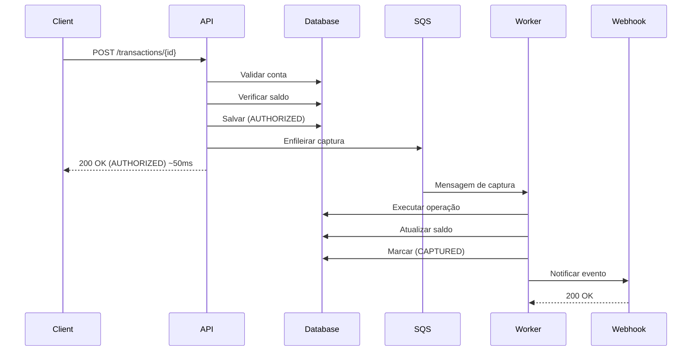

# 💳 Transaction Authorizer

Sistema de autorização de transações financeiras com suporte a débito e crédito, construído com Spring Boot 4 e arquitetura limpa.

## 🚀 Funcionalidades

- ✅ Processamento de transações de **débito** e **crédito**
- ✅ **Padrão Auth & Capture Assíncrono** para alta performance
- ✅ **Idempotência** baseada em UUID de transação
- ✅ **Controle de concorrência** com Optimistic Locking
- ✅ Validação de saldo antes de débitos
- ✅ Consumo de eventos SQS para criação de contas
- ✅ **Sistema de Webhooks** com notificações assíncronas
- ✅ API REST documentada com **Swagger/OpenAPI**
- ✅ Tratamento de DLQ (Dead Letter Queue)

## 🏗️ Arquitetura

O projeto segue os princípios de **Clean Architecture** e **Domain-Driven Design**:

```
📦 transaction-authorizer
├── 🎯 domain/           # Modelos de domínio e regras de negócio
├── 🔧 application/      # Casos de uso (Use Cases)
├── 🌐 infra/            # Infraestrutura (API, DB, Mensageria)
└── ✅ test/             # Testes unitários e de integração
```

### Padrões de Design

- **Auth & Capture Pattern** → Processamento assíncrono de transações
- **Strategy Pattern** → Operações de transação (Débito/Crédito)
- **Repository Pattern** → Abstração de persistência
- **Adapter Pattern** → Conversão Domain ↔ Infrastructure
- **Use Case Pattern** → Lógica de aplicação isolada
- **Webhook Pattern** → Notificações assíncronas de eventos

## 🔄 Fluxo de Transação Auth & Capture

O sistema utiliza o padrão **Auth & Capture** para processar transações de forma assíncrona, otimizando performance e escalabilidade:

### Fase 1: Authorization (Síncrona - ~50ms)
1. API recebe requisição de transação
2. Valida conta existe
3. Verifica saldo suficiente (apenas DEBIT)
4. Salva transação com status `AUTHORIZED`
5. Enfileira na fila SQS `transaction-capture-queue`
6. **Retorna imediatamente** para o cliente

### Fase 2: Capture (Assíncrona)
1. Worker consome mensagem da fila
2. Executa operação de débito/crédito
3. Atualiza saldo da conta
4. Marca transação como `CAPTURED`
5. **Dispara webhook** de notificação



### Estados de Transação

| Estado | Descrição |
|--------|-----------|
| `PENDING` | Requisição recebida (não utilizado atualmente) |
| `AUTHORIZED` | Saldo reservado/validado - fase síncrona completa |
| `CAPTURED` | Movimentação efetivada - fase assíncrona completa |
| `SETTLED` | Conciliado/Finalizado (uso futuro) |
| `FAILED` | Falhou (conta inexistente, saldo insuficiente, etc) |
| `REVERSED` | Estornado (uso futuro) |

### Sistema de Webhooks

O sistema envia notificações via webhook quando transações são capturadas:

#### Payload do Webhook

```json
{
  "event_id": "550e8400-e29b-41d4-a716-446655440000",
  "event_type": "transaction.captured",
  "transaction_id": "7c9e6679-7425-40de-944b-e07fc1f90ae7",
  "account_id": "550e8400-e29b-41d4-a716-446655440000",
  "status": "CAPTURED",
  "timestamp": "2025-12-24T10:30:00-03:00",
  "data": {
    "amount": 50.00,
    "currency": "BRL",
    "operation": "DEBIT"
  }
}
```

#### Validação de Signature

Todos os webhooks incluem um header `X-Webhook-Signature` com HMAC SHA-256:

```bash
X-Webhook-Signature: sha256=<hash>
```

Para validar:

```java
String payload = objectMapper.writeValueAsString(event);
String expectedSignature = HmacUtils.hmacSha256Hex(webhookSecret, payload);
// Comparar com header X-Webhook-Signature (remover prefixo "sha256=")
```

#### Configuração do Webhook

Configure via variáveis de ambiente:

```bash
WEBHOOK_URL=https://seu-endpoint.com/webhook
WEBHOOK_SECRET=seu-secret-super-seguro
WEBHOOK_ENABLED=true
```

#### Endpoint de Teste Local

O sistema inclui um endpoint mock para testar webhooks localmente:

```bash
# O endpoint /webhook-test já está configurado por padrão
# Logs aparecem no console do container api
docker-compose logs -f api | grep webhook
```

## 🛠️ Stack Tecnológica

| Tecnologia | Versão | Descrição |
|------------|--------|-----------|
| Java | 17 | Linguagem de programação |
| Spring Boot | 4.0.1 | Framework principal |
| Spring Data JPA | 4.0.1 | Persistência |
| PostgreSQL | 15 | Banco de dados |
| AWS SQS | - | Mensageria |
| Docker | - | Containerização |
| LocalStack | - | Emulação AWS local |

## 📋 Pré-requisitos

- **Java 17+**
- **Docker** e **Docker Compose**
- **Maven 3.9+** (opcional, wrapper incluído)

## 🚀 Quick Start

### 1️⃣ Clone o repositório

```bash
git clone https://github.com/msvidal/transaction-authorizer.git
cd transaction-authorizer
```

### 2️⃣ Inicie os serviços com Docker

```bash
chmod +x build-and-run.sh
./build-and-run.sh
```

Ou manualmente:

```bash
docker-compose up -d --build
```

### 3️⃣ Aguarde a inicialização (~30s)

```bash
docker-compose logs -f api
```

### 4️⃣ Acesse a aplicação

| Serviço | URL | Descrição |
|---------|-----|-----------|
| 🌐 API | http://localhost:8080 | Aplicação principal |
| 📚 Swagger UI | http://localhost:8080/swagger-ui.html | Documentação interativa |
| 📊 Actuator | http://localhost:8080/actuator | Endpoints de monitoramento |

## 📖 Uso da API

### Criar uma conta (via SQS)

```bash
aws --endpoint-url=http://localhost:4566 sqs send-message \
  --queue-url http://localhost:4566/000000000000/account-events \
  --message-body '{
    "account":  {
      "id": "550e8400-e29b-41d4-a716-446655440000",
      "owner": "123e4567-e89b-12d3-a456-426614174000",
      "balance":  1000.00,
      "createdAt": 1735000000
    }
  }'
```

### Processar transação de DÉBITO

```bash
curl -X POST http://localhost:8080/transactions/7c9e6679-7425-40de-944b-e07fc1f90ae7 \
  -H "Content-Type: application/json" \
  -d '{
    "account_id": "550e8400-e29b-41d4-a716-446655440000",
    "amount": {
      "value": 50.00,
      "currency":  "BRL"
    },
    "operation": "DEBIT"
  }'
```

**Resposta:**

```json
{
  "transaction": {
    "id": "7c9e6679-7425-40de-944b-e07fc1f90ae7",
    "operation": "DEBIT",
    "amount":  {
      "value": 50.00,
      "currency":  "BRL"
    },
    "status": "AUTHORIZED",
    "created_at": "2025-12-20T21:30:00-03:00"
  },
  "account": {
    "id": "550e8400-e29b-41d4-a716-446655440000",
    "balance":  {
      "value": 1000.00,
      "currency":  "BRL"
    }
  },
  "webhook_notification": true
}
```

> ⚡ **Nota**: A transação retorna imediatamente com status `AUTHORIZED`. O saldo será atualizado e um webhook será enviado após o processamento assíncrono (status `CAPTURED`).

### Processar transação de CRÉDITO

```bash
curl -X POST http://localhost:8080/transactions/8d8f7780-8536-51ef-b95c-f18gd2g01bf8 \
  -H "Content-Type: application/json" \
  -d '{
    "account_id": "550e8400-e29b-41d4-a716-446655440000",
    "amount": {
      "value": 200.00,
      "currency":  "BRL"
    },
    "operation": "CREDIT"
  }'
```

### Idempotência

Enviar a mesma transação (mesmo UUID) múltiplas vezes retorna o mesmo resultado:

```bash
# Primeira chamada - processa
curl -X POST http://localhost:8080/transactions/SAME-UUID-HERE ... 

# Segunda chamada - retorna resultado anterior (não processa novamente)
curl -X POST http://localhost:8080/transactions/SAME-UUID-HERE ... 
```

## 🏗️ Desenvolvimento Local

### Executar sem Docker

```bash
# 1. Inicie PostgreSQL e LocalStack
docker-compose up -d postgres localstack

# 2. Configure variáveis de ambiente
export SPRING_PROFILES_ACTIVE=api,local
export SPRING_DATASOURCE_URL=jdbc:postgresql://localhost:5432/transactiondb
export SPRING_DATASOURCE_USERNAME=user
export SPRING_DATASOURCE_PASSWORD=password
export AWS_SQS_ENDPOINT=http://localhost:4566

# 3. Execute a aplicação
./mvnw spring-boot:run
```

### Executar Testes

```bash
# Todos os testes
./mvnw test

# Testes específicos
./mvnw test -Dtest=ProcessTransactionUseCaseTest

# Com coverage
./mvnw test jacoco:report
```

## 🗂️ Estrutura do Projeto

```
src/
├── main/
│   ├── java/.../transactionauthorizer/
│   │   ├── TransactionAuthorizerApplication.java
│   │   ├── domain/
│   │   │   ├── exception/
│   │   │   ├── model/         # Account, Transaction, MonetaryAmount, WebhookEvent
│   │   │   ├── repository/    # Interfaces
│   │   │   └── service/       # Strategy Pattern, WebhookNotificationService
│   │   ├── application/
│   │   │   └── usecase/       # AuthorizeTransaction, CaptureTransaction, CreateAccount
│   │   └── infra/
│   │       ├── api/           # Controllers, DTOs, WebhookTestController
│   │       ├── persistence/   # JPA Entities, Adapters
│   │       ├── messaging/     # SQS Listeners (Account, TransactionCapture)
│   │       ├── webhook/       # WebhookNotificationAdapter
│   │       └── config/        # Configurações (SQS, Webhook)
│   └── resources/
│       ├── application.yaml
│       ├── application-api.yaml
│       ├── application-listener.yaml
│       └── application-local.yaml
└── test/
    └── java/.../transactionauthorizer/
        ├── application/       # Use Case tests
        ├── domain/
        └── infra/            # Controller, Webhook, Messaging tests
```

## 🔧 Configuração

### Variáveis de Ambiente

| Variável | Descrição | Padrão |
|----------|-----------|--------|
| `SPRING_PROFILES_ACTIVE` | Profiles ativos | `api` |
| `SPRING_DATASOURCE_URL` | URL do PostgreSQL | - |
| `SPRING_DATASOURCE_USERNAME` | Usuário do banco | `user` |
| `SPRING_DATASOURCE_PASSWORD` | Senha do banco | `password` |
| `AWS_SQS_ENDPOINT` | Endpoint SQS (LocalStack) | - |
| `AWS_SQS_QUEUE_NAME` | Nome da fila SQS de contas | `conta-bancaria-criada` |
| `AWS_SQS_CAPTURE_QUEUE_NAME` | Nome da fila SQS de captura | `transaction-capture-queue` |
| `AWS_SQS_CAPTURE_DLQ_NAME` | Nome da DLQ de captura | `transaction-capture-dlq` |
| `AWS_REGION` | Região AWS | `sa-east-1` |
| `WEBHOOK_URL` | URL para envio de webhooks | `http://api:8080/webhook-test` |
| `WEBHOOK_SECRET` | Secret para assinatura HMAC | `super-secret-key-change-in-production` |
| `WEBHOOK_ENABLED` | Habilitar webhooks | `true` |

### Profiles Spring

- **`api`** - Expõe API REST
- **`listener`** - Consome mensagens SQS
- **`local`** - Ambiente de desenvolvimento (api + listener)

## 🐳 Docker Compose

O projeto inclui os seguintes serviços:

```yaml
services:
  - postgres          # Banco de dados
  - localstack        # Emulação AWS (SQS)
  - sqs-init          # Inicialização das filas SQS
  - message-generator # Geração de contas de teste
  - api               # API REST
  - listener          # Consumidor SQS (Contas + Captura de transações)
```

### Filas SQS

| Fila | Descrição |
|------|-----------|
| `conta-bancaria-criada` | Eventos de criação de contas |
| `transaction-capture-queue` | Mensagens de captura de transações |
| `transaction-capture-dlq` | DLQ para capturas com falhas |

## 🧪 Testes

### Cobertura de Testes

- ✅ Testes unitários (Use Cases)
- ✅ Testes de repository adapters
- ✅ Testes de mensageria (SQS)
- ✅ Testes de validação

### Executar com Coverage

```bash
./mvnw clean test jacoco:report
open target/site/jacoco/index. html
```

## 🔐 Segurança

⚠️ **IMPORTANTE**: Este projeto é uma **demonstração** e não deve ser usado em produção sem:

- Implementar autenticação/autorização (Spring Security, OAuth2)
- Adicionar rate limiting
- Implementar auditoria completa

## 📈 Performance

### Otimizações Implementadas

- ✅ **Auth & Capture Assíncrono** (latência reduzida de ~500ms para ~50ms)
- ✅ Processamento assíncrono via SQS (escalabilidade horizontal)
- ✅ Optimistic Locking (evita locks pessimistas)
- ✅ Retry automático em conflitos e falhas
- ✅ Idempotência (evita processamento duplicado)
- ✅ Índices de banco de dados
- ✅ Connection pooling (HikariCP)
- ✅ Docker multi-stage build
- ✅ Webhook com retry e backoff exponencial

### Resultados Esperados

| Métrica | Antes | Depois |
|---------|-------|--------|
| Latência da API | ~500ms | ~50ms |
| Throughput | Limitado | Escalável |
| Lock de DB | Alto | Baixo |
| Workers | Monolítico | Escalável horizontalmente |

## 👤 Autor

**msvidal**
- GitHub: [@msvidal](https://github.com/msvidal)
